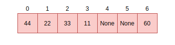
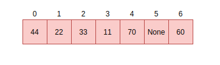

.. _coreruntime:

The MicroPython Core Runtime
============================

This chapter details the core components of MicroPython including
the compiler, memory management, known optimizations, the core and
dynamic modules and the public C API.

For purposes of this chapter, the location of focus is the ``py``
directory.

The compiler
------------

The compilation process in MicroPython involves the following steps:

* The lexer converts the stream of text that makes up a MicroPython program into tokens.
* The parser then converts the tokens into abstract syntax (parse tree).
* Then bytecode or native code is emitted based on the parse tree.

Changing the grammar
~~~~~~~~~~~~~~~~~~~~

MicroPython's grammar is based on the `CPython grammar <https://docs.python.org/3.5/reference/grammar.html>`_
and is defined in ``py/grammar.h``. This grammar is what is used to parse MicroPython source files.

There are two macros you need to know to define a grammar rule i.e ``DEF_RULE`` or ``DEF_RULE_NC``.
``DEF_RULE`` allows you to define a rule with a compile function. 

A simple grammar definition with a compile function looks like the following:

.. code-block:: c

   DEF_RULE(add1_stmt, c(add1_stmt), and(2), tok(KW_ADD))

The second argument ``c(add1_stmt)`` is the corresponding compile function that should be implemented
in ``py/compile.c`` for this rule. 

The third important argument can be ``or`` or ``and``. This specifies the number of nodes associated with a statement. 
For example, in this case, our ``add1`` statement is similar to ADD1 in assembly language. It takes one numeric argument
and adds 1 to it. Therefore, the ``add1_stmt`` has two nodes associated with it. One for the statement itself 
i.e ``add1`` and the other for its argument.

.. note::
   The ``add1`` rule here is just an example and not part of the standard
   MicroPython grammar.

Finally, the fourth argument in this example is the token associated with the rule. This token should be
defined in the lexer by editing ``py/lexer.h``.

Defining the same rule without a compile function is achieved by using the ``DEF_RULE_NC`` macro
and omitting the compile function argument:

.. code-block:: c

   DEF_RULE_NC(add1_stmt, and(2), tok(KW_ADD))

The remaining arguments take on the same meaning.

.. note::
   The function ``DEF_RULE`` or ``DEF_RULE_NC`` takes other arguments. For an in-depth understanding
   of supported parameters, see ``py/grammar.h``.

Changing the lexer
~~~~~~~~~~~~~~~~~~

Every rule defined in the grammar should have a token associated with it and defined in ``py/lexer.h``. 
Add this token by editing the ``_mp_token_kind_t`` enum:

.. code-block:: c
   :emphasize-lines: 12

   typedef enum _mp_token_kind_t {
    ...
    ...
    P_TOKEN_KW_OR,
    MP_TOKEN_KW_PASS,
    MP_TOKEN_KW_RAISE,
    MP_TOKEN_KW_RETURN,
    MP_TOKEN_KW_TRY,
    MP_TOKEN_KW_WHILE,
    MP_TOKEN_KW_WITH,
    MP_TOKEN_KW_YIELD,
    MP_TOKEN_KW_ADD1,
   } mp_token_kind_t;

Since, we are adding a keyword, edit ``py/lexer.c`` to add the new keyword:

.. code-block:: c
   :emphasize-lines: 40

   STATIC const char *const tok_kw[] = {
    "False",
    "None",
    "True",
    "__debug__",
    "and",
    "as",
    "assert",
    #if MICROPY_PY_ASYNC_AWAIT
    "async",
    "await",
    #endif
    "break",
    "class",
    "continue",
    "def",
    "del",
    "elif",
    "else",
    "except",
    "finally",
    "for",
    "from",
    "global",
    "if",
    "import",
    "in",
    "is",
    "lambda",
    "nonlocal",
    "not",
    "or",
    "pass",
    "raise",
    "return",
    "try",
    "while",
    "with",
    "yield",
    "add1",
   };

Notice the keyword is named depending on what you want it to be. For consistency, maintain the
naming standard accordingly.

.. note::
   The order of these keywords in ``py/lexer.c`` should match the order of tokens in the enum
   defined in ``py/lexer.h``.

Parsing
~~~~~~~~

The parser takes the tokens produced by the lexer and converts them to an abstract syntax tree (AST) or
*parse tree*. The implementation for the parser is defined in ``py/parse.c``. 

The parser also maintains a table of constants for use in different aspects of parsing, similar to what a `symbol 
table <https://steemit.com/programming/@drifter1/writing-a-simple-compiler-on-my-own-symbol-table-basic-structure>`_ 
does.

Several optimizations like `constant folding <http://compileroptimizations.com/category/constant_folding.htm>`_ 
on integers for all operations i.e logical, binary, unary, etc, optimizing enhancements on parenthesis
around expressions are performed during this phase and optimizations on strings.

It's worth noting that *docstrings* are discarded and not 
accessible to the compiler. Even optimizations like `string interning <https://en.wikipedia.org/wiki/String_interning>`_ are 
not applied to *docstrings*.

Compiler passes
~~~~~~~~~~~~~~~

Like many compilers, MicroPython compiles all code to MicroPython bytecode or native code for
execution by the virtual machine. The functionality that achieves this is implemented in``py/compile.c``.
The most relevant method you should know 
about is:

.. code-block:: c

   mp_raw_code_t *mp_compile_to_raw_code(mp_parse_tree_t *parse_tree, 
   qstr source_file, bool is_repl)

The compiler compiles the code in several passes.

**First pass**

In the first pass, the compiler computes the stack sizes in scope:

.. code-block:: c

   // compile pass 1
   comp->emit = emit_bc;
   #if MICROPY_EMIT_NATIVE
   comp->emit_method_table = &emit_bc_method_table;
   #endif
   uint max_num_labels = 0;
   for (scope_t *s = comp->scope_head; s != NULL && comp->compile_error == MP_OBJ_NULL; s = s->next) {
        #if MICROPY_EMIT_INLINE_ASM
        if (s->emit_options == MP_EMIT_OPT_ASM) {
            compile_scope_inline_asm(comp, s, MP_PASS_SCOPE);
        } else
        #endif
        {
            compile_scope(comp, s, MP_PASS_SCOPE);

            // Check if any implicitly declared variables should be closed over
            for (size_t i = 0; i < s->id_info_len; ++i) {
                id_info_t *id = &s->id_info[i];
                if (id->kind == ID_INFO_KIND_GLOBAL_IMPLICIT) {
                    scope_check_to_close_over(s, id);
                }
            }
        }
   ..
   }

Other computations regarding scopes and identifiers are computed too.
At this point, the number of labels that will be required in the 
emitted code is also determined and set.

**Second and third passes**

The second and third passes involve computing the code size and emitting the ``inline assembler code`` for
the different architectures:

.. code-block:: c
   
   // compile pass 2 and 3
   #if MICROPY_EMIT_NATIVE
   emit_t *emit_native = NULL;
   #endif
   for (scope_t *s = comp->scope_head; s != NULL && comp->compile_error == MP_OBJ_NULL; s = s->next) {
        #if MICROPY_EMIT_INLINE_ASM
        if (s->emit_options == MP_EMIT_OPT_ASM) {
            // inline assembly
            if (comp->emit_inline_asm == NULL) {
                comp->emit_inline_asm = ASM_EMITTER(new)(max_num_labels);
            }
            comp->emit = NULL;
            comp->emit_inline_asm_method_table = ASM_EMITTER_TABLE;
            compile_scope_inline_asm(comp, s, MP_PASS_CODE_SIZE);
            #if MICROPY_EMIT_INLINE_XTENSA
            // Xtensa requires an extra pass to compute size of l32r const table
            // TODO this can be improved by calculating it during SCOPE pass
            // but that requires some other structural changes to the asm emitters
            #if MICROPY_DYNAMIC_COMPILER
            if (mp_dynamic_compiler.native_arch == MP_NATIVE_ARCH_XTENSA)
            #endif
            {
                compile_scope_inline_asm(comp, s, MP_PASS_CODE_SIZE);
            }
            #endif
            if (comp->compile_error == MP_OBJ_NULL) {
                compile_scope_inline_asm(comp, s, MP_PASS_EMIT);
            }
        } else

The inline assembler code comprises assembly instructions in a Python function.
See `the inline assembler tutorial 
<https://docs.micropython.org/en/latest/pyboard/tutorial/assembler.html#pyboard-tutorial-assembler>`_ 
for more details.

**Fourth, fifth and sixth passes**

The other two passes compute the stack and code size, while the last pass emits the final code:

.. code-block:: c
   
   compile_scope(comp, s, MP_PASS_STACK_SIZE);

   if (comp->compile_error == MP_OBJ_NULL) {
        compile_scope(comp, s, MP_PASS_CODE_SIZE);
   }

   if (comp->compile_error == MP_OBJ_NULL) {
    compile_scope(comp, s, MP_PASS_EMIT);
   }

Before these passes, there is a selection for the type of code to be emitted which can either be native or
bytecode.

.. code-block:: c

   switch (s->emit_options) {

        #if MICROPY_EMIT_NATIVE
        case MP_EMIT_OPT_NATIVE_PYTHON:
        case MP_EMIT_OPT_VIPER:
            if (emit_native == NULL) {
                emit_native = NATIVE_EMITTER(new)(&comp->compile_error, &comp->next_label, max_num_labels);
            }
            comp->emit_method_table = NATIVE_EMITTER_TABLE;
            comp->emit = emit_native;
            break;
        #endif // MICROPY_EMIT_NATIVE

        default:
            comp->emit = emit_bc;
            #if MICROPY_EMIT_NATIVE
                comp->emit_method_table = &emit_bc_method_table;
            #endif
            break;
   }

The bytecode option is the default but something unique to note for the native code option is that there is 
another option via ``VIPER``. See the *Emitting native code* section for
more details on viper annotations.

Emitting bytecode
~~~~~~~~~~~~~~~~~

For every statement in the code, there is a corresponding function to emit MicroPython bytecode. 
This function should be written in ``py/emitbc.c``. The implementation of this function looks similar
to this:

.. code-block:: c
   
   void mp_emit_bc_yield(emit_t *emit, int kind) {
        MP_STATIC_ASSERT(MP_BC_YIELD_VALUE + 1 == MP_BC_YIELD_FROM);
        emit_write_bytecode_byte(emit, -kind, MP_BC_YIELD_VALUE + kind);
        emit->scope->scope_flags |= MP_SCOPE_FLAG_GENERATOR;
   }

We use the ``yield`` statement for an example here but the implementation details are similar for other statements.
The method ``emit_write_bytecode_byte()`` is a wrapper around the main function ``emit_get_cur_to_write_bytecode()``
that all functions must call to emit byte code.

Emitting native code
~~~~~~~~~~~~~~~~~~~~

Similar to how bytecode is generated, there should be a corresponding function in ``py/emitnative.c`` for each
code statement:

.. code-block:: c

   STATIC void emit_native_yield(emit_t *emit, int kind) {
    // Note: 1 (yield) or 3 (yield from) labels are reserved for this function, starting at *emit->label_slot

    if (emit->do_viper_types) {
        mp_raise_NotImplementedError(MP_ERROR_TEXT("native yield"));
    }
    emit->scope->scope_flags |= MP_SCOPE_FLAG_GENERATOR;

    need_stack_settled(emit);

    if (kind == MP_EMIT_YIELD_FROM) {

        // Top of yield-from loop, conceptually implementing:
        //     for item in generator:
        //         yield item

        // Jump to start of loop
        emit_native_jump(emit, *emit->label_slot + 2);

        // Label for top of loop
        emit_native_label_assign(emit, *emit->label_slot + 1);
    }

    // Save pointer to current stack position for caller to access yielded value
    emit_get_stack_pointer_to_reg_for_pop(emit, REG_TEMP0, 1);
    emit_native_mov_state_reg(emit, OFFSETOF_CODE_STATE_SP, REG_TEMP0);

    // Put return type in return value slot
    ASM_MOV_REG_IMM(emit->as, REG_TEMP0, MP_VM_RETURN_YIELD);
    ASM_MOV_LOCAL_REG(emit->as, LOCAL_IDX_RET_VAL(emit), REG_TEMP0);

    // Save re-entry PC
    ASM_MOV_REG_PCREL(emit->as, REG_TEMP0, *emit->label_slot);
    emit_native_mov_state_reg(emit, LOCAL_IDX_GEN_PC(emit), REG_TEMP0);

    // Jump to exit handler
    ASM_JUMP(emit->as, emit->exit_label);

    // Label re-entry point
    mp_asm_base_label_assign(&emit->as->base, *emit->label_slot);

    // Re-open any active exception handler
    if (emit->exc_stack_size > 0) {
        // Find innermost active exception handler, to restore as current handler
        exc_stack_entry_t *e = &emit->exc_stack[emit->exc_stack_size - 1];
        for (; e >= emit->exc_stack; --e) {
            if (e->is_active) {
                // Found active handler, get its PC
                ASM_MOV_REG_PCREL(emit->as, REG_RET, e->label);
                ASM_MOV_LOCAL_REG(emit->as, LOCAL_IDX_EXC_HANDLER_PC(emit), REG_RET);
                break;
            }
        }
    }

    emit_native_adjust_stack_size(emit, 1); // send_value

    if (kind == MP_EMIT_YIELD_VALUE) {
        // Check LOCAL_IDX_EXC_VAL for any injected value
        ASM_MOV_REG_LOCAL(emit->as, REG_ARG_1, LOCAL_IDX_EXC_VAL(emit));
        emit_call(emit, MP_F_NATIVE_RAISE);
    } else {
        // Label loop entry
        emit_native_label_assign(emit, *emit->label_slot + 2);

        // Get the next item from the delegate generator
        vtype_kind_t vtype;
        emit_pre_pop_reg(emit, &vtype, REG_ARG_2); // send_value
        emit_access_stack(emit, 1, &vtype, REG_ARG_1); // generator
        ASM_MOV_REG_LOCAL(emit->as, REG_ARG_3, LOCAL_IDX_EXC_VAL(emit)); // throw_value
        emit_post_push_reg(emit, VTYPE_PYOBJ, REG_ARG_3);
        emit_get_stack_pointer_to_reg_for_pop(emit, REG_ARG_3, 1); // ret_value
        emit_call(emit, MP_F_NATIVE_YIELD_FROM);

        // If returned non-zero then generator continues
        ASM_JUMP_IF_REG_NONZERO(emit->as, REG_RET, *emit->label_slot + 1, true);

        // Pop exhausted gen, replace with ret_value
        emit_native_adjust_stack_size(emit, 1); // ret_value
        emit_fold_stack_top(emit, REG_ARG_1);
    }
   }

The difference here is that we have to handle *viper typing*. Viper annotations allow
us to emit more that one type of object. By default, Python objects are emmited
but with Viper, something can be declared as a Python object or any type. Viper is
therefore a subset of Python objects infact if anything is declared in Viper
as a Python object, it acts as native Python. Viper typing may break Python equivalence as
intergers become native integers and not Python objects.

<<<<<<< HEAD
Memory Management
-----------------

Unlike many programming languages such as C/C++, MicroPython hides memory management details 
from the developer by supporting automatic memory management (AMM).
AMM is a technique used by operating systems or applications to automatically manage the allocation and deallocation of memory. This eliminates challenges such as forgetting to
free the memory allocated to an object. AMM also avoids the critical issue of using memory
=======
Optimizations
-------------

String interning
~~~~~~~~~~~~~~~~~

having to store duplicate copies of the same string.  Primarily, this applies to
identifiers in your code, as something like a function or variable name is very
likely to appear in multiple places in the code.  In MicroPython an interned
string is called a QSTR (uniQue STRing).

A QSTR value (with type ``qstr``) is an index into a linked list of QSTR pools.
QSTRs store their length and a hash of their contents for fast comparison during
the de-duplication process.  All bytecode operations that work with strings use
a QSTR argument.

**Compile-time QSTR generation**

In the MicroPython C code, any strings that should be interned in the final
firmware are written as ``MP_QSTR_Foo``.  At compile time this will evaluate to
a ``qstr`` value that points to the index of ``"Foo"`` in the QSTR pool.

A multi-step process in the ``Makefile`` makes this work.  In summary, this
process has three parts:

1. Find all ``MP_QSTR_Foo`` tokens in the code.

2. Generate a static QSTR pool containing all the string data (including lengths and hashes).

3. Replace all ``MP_QSTR_Foo`` (via the preprocessor) with their corresponding index.

``MP_QSTR_Foo`` tokens are searched for in two sources:

1. All files referenced in ``$(SRC_QSTR)``.  This is all C code (i.e. ``py``,
   ``extmod``, ``ports/stm32``) but not including third-party code such as
   ``lib``.

2. Additional ``$(QSTR_GLOBAL_DEPENDENCIES)`` (which includes ``mpconfig*.h``).

*Note:* ``frozen_mpy.c`` (generated by mpy-tool.py) has its own QSTR generation
and pool.

Some additional strings that can't be expressed using the ``MP_QSTR_Foo`` syntax
(e.g. they contain non-alphanumeric characters) are explicitly provided in
``qstrdefs.h`` and ``qstrdefsport.h`` via the ``$(QSTR_DEFS)`` variable.

Processing happens in the following stages:

1. ``qstr.i.last`` is the concatenation of putting every single input file through the C pre-processor.  This means that any conditionally disabled code will be removed, and macros expanded.  This means we don't add strings to the pool that won't be used in the final firmware.  Because at this stage (thanks to the ``NO_QSTR`` macro added by ``QSTR_GEN_EXTRA_CFLAGS``) there is no definition for ``MP_QSTR_Foo`` it passes through this stage unaffected.  This file also includes comments from the preprocessor that include line number information.  Note that this step only uses files that have changed, which means that ``qstr.i.last`` will only contain data from files that have changed since the last compile.
2. ``qstr.split`` is an empty file created after running ``makeqstrdefs.py split``
   on qstr.i.last. It's just used as a dependency to indicate that the step ran.
   This script outputs one file per input C file,  ``genhdr/qstr/...file.c.qstr``,
   which contains only the matched QSTRs. Each QSTR is printed as ``Q(Foo)``.
   This step is necessary to combine the existing files with the new data generated from the incremental update in ``qstr.i.last``.

3. ``qstrdefs.collected.h`` is the output of concatenating ``genhdr/qstr/*``
   using ``makeqstrdefs.py cat``.  This is now the full set of ``MP_QSTR_Foo``'s
   found in the code, now formatted as ``Q(Foo)``, one-per-line, with duplicates.
   This file is only updated if the set of qstrs has changed.  A hash of the QSTR
   data is written to another file (``qstrdefs.collected.h.hash``) which allows it to track changes across builds.

4. ``qstrdefs.preprocessed.h`` adds in the QSTRs from qstrdefs*.  It
   concatenates ``qstrdefs.collected.h`` with ``qstrdefs*.h``, then it transforms
   each line from ``Q(Foo)`` to ``"Q(Foo)"`` so they pass through the preprocessor
   unchanged.  Then the preprocessor is used to deal with any conditional compilation in ``qstrdefs*.h``.  Then the transformation is undone back to
   ``Q(Foo)``, and saved as ``qstrdefs.preprocessed.h``.

5. ``qstrdefs.generated.h`` is the output of ``makeqstrdata.py``.  For each
   ``Q(Foo)`` in qstrdefs.preprocessed.h (plus some extra hard-coded ones), it outputs
   ``QDEF(MP_QSTR_Foo, (const byte*)"hash" "Foo")``.

Then in the main compile, two things happen with ``qstrdefs.generated.h``:

1. In qstr.h, each QDEF becomes an entry in an enum, which makes ``MP_QSTR_Foo``
   available to code and equal to the index of that string in the QSTR table.

2. In qstr.c, the actual QSTR data table is generated as elements of the
   ``mp_qstr_const_pool->qstrs``.

.. _`string interning`: https://en.wikipedia.org/wiki/String_interning

**Run-time QSTR generation**

Additional QSTR pools can be created at runtime so that strings can be added to
them. For example, the code::

  foo[x] = 3

Will need to create a QSTR for the value of ``x`` so it can be used by the
"load attr" bytecode.

Also, when compiling Python code, identifiers and literals need to have QSTRs
created.  Note: only literals shorter than 10 characters become QSTRs.  This is
because a regular string on the heap always takes up a minimum of 16 bytes (one
GC block), whereas QSTRs allow them to be packed more efficiently into the pool.

QSTR pools (and the underlying "chunks" that store the string data) are allocated
on-demand on the heap with a minimum size.

Open addressing
~~~~~~~~~~~~~~~

MicroPython dictionaries use a technique called `open addressing <https://en.wikipedia.org/wiki/Open_addressing>`_
to resolve collisions. Collisions are very common occurrences and happen when two items happen to hash to the same
slot or location. For example, given a hash setup as this:

If there is a request to fill slot ``0`` with ``70``, since the slot ``0`` is not empty, open addressing
finds the next available slot in the dictionary to service this request. This sequential search for an alternate
location is called *probing*. There are several sequence probing algorithms but MicroPython uses
linear probing that is described in the next section.

Linear probing
~~~~~~~~~~~~~~

Linear probing is one of the methods for finding an available address or slot in a dictionary. In MicroPython,
it is used with open addressing. To service the request described above, unlike other probing algorithms,
linear probing assumes a fixed interval of ``1`` between probes. The request will therefore be serviced by
placing the item in the next free slot which is slot ``4`` in our example:

The same methods i.e open addressing and linear probing are used to search for an item in a dictionary. 
Assume we want to search for the data item ``33``. The computed hash value will be 2. Looking at slot 2 
reveals ``33``, at this point, we return ``True``. Searching for ``70`` is quite different as there was a 
collision at the time of insertion. Therefore computing the hash value is ``0`` which is currently
holding ``44``. Instead of simply returning ``False``, we perform a sequential search starting at point
``1`` until the item ``70`` is found or we encounter a free slot. This is the general way of performing
look-ups in hashes:

.. code-block:: c
   
   // not yet found, keep searching in this table
   pos = (pos + 1) % set->alloc;

   if (pos == start_pos) {
    // search got back to starting position, so index is not in table
    if (lookup_kind & MP_MAP_LOOKUP_ADD_IF_NOT_FOUND) {
        if (avail_slot != NULL) {
            // there was an available slot, so use that
            set->used++;
            *avail_slot = index;
            return index;
        } else {
            // not enough room in table, rehash it
            mp_set_rehash(set);
            // restart the search for the new element
            start_pos = pos = hash % set->alloc;
        }
    } else {
        return MP_OBJ_NULL;
    }
   }

Memory management
-----------------

Unlike many programming languages such as C/C++, MicroPython hides memory management 
details from the developer by supporting automatic memory management.
Automatic memory management is a technique used by operating systems or applications to automatically manage 
the allocation and deallocation of memory. This eliminates challenges such as forgetting to
free the memory allocated to an object. Automatic memory management also avoids the critical issue of using memory
>>>>>>> db88b0d... viper and block properties
that is already released. Automatic memory management takes many forms, one of them being
garbage collection (GC).

The garbage collector usually has two responsibilities;

#. Allocate new objects in available memory.
#. Free unused memory.

There are many GC algorithms but MicroPython uses the 
`Mark and Sweep <https://www.geeksforgeeks.org/mark-and-sweep-garbage-collection-algorithm/>`_
policy for managing memory. This algorithm has a mark phase that traverses the heap marking all
live objects while the sweep phase goes through the heap reclaiming all unmarked objects.

.. note::
   The garbage collector automatically runs on the Linux port but may need to be manually 
   enabled for other ports.

Garbage collection functionality in MicroPython is available through the ``gc`` built-in
module:

.. code-block:: console
   
   >>> x = 5
   >>> x
   5
   >>> import gc
   >>> gc.enable()
   >>> gc.mem_alloc()
   1312
   >>> gc.mem_free()
   2071392
   >>> gc.collect()
   19
   >>> gc.disable()
   >>> 

Even when ``gc.disable()`` is invoked, collection can be triggered with ``gc.collect()``.

The object model
~~~~~~~~~~~~~~~~

The structure of a MicroPython object is such that is takes up a word-size. That is to say, 
pointers and addresses take up a machine word of 8 bytes. Pointers can be 8, 16 or 64 bits.

``********|********|********|********|********|********|********|********<tag><tag><tag>``

In a 1 byte address, the 61 bits will hold a value while the 3 lower bits will hold a tag.
This brings us to a concept that MicroPython supports that involves applying a tag to a pointer.

**Pointer tagging**

More often than not the lower 3 bits of a pointer are zeroes i.e:

``********|********|********|********|********|********|********|********000``

These bits are reserved for purposes of storing a tag. A tag is a place holder that is used
to store extra information as opposed to introducing a new field to store information usually 
in the object which may be inefficient. 

The tags can store information like if we are dealing with a small integer, interned (small)
string or a concrete object as different semantics apply to each of these.

For small integers the mapping is this:

``********|..|******01``

For a small or interned string:

``********|..|******10``

While a concrete object that is neither a small integer nor an interned string takes this form:

``********|..|******00``

Allocation of objects
~~~~~~~~~~~~~~~~~~~~~~

Small integers take up 8 bytes and will be allocated on the stack and not the heap. This implies
<<<<<<< HEAD
that the allocation of such integers does not affect the heap. Similarly, interned strings are small - usually
less of a length less than 10 are stored as an array.
=======
that the allocation of such integers does not affect the heap. Similarly, interned strings are small - usually,
of a length less than 10 are stored as an array.
>>>>>>> db88b0d... viper and block properties

Everything else which is a concrete object is allocated on the heap and its object structure is such that
a field is reserved in the object header to store the type of the object.

.. code-block:: console

    +++++++++++
    +         +
    + type    + object header
    +         +
    +++++++++++
    +         + object items
    +         +
    +         +
    +++++++++++
    

The heap's unit of allocation is a block that is to say the heap is further subdivided into blocks of 32 bytes. Another structure also allocated on the heap tracks the allocation of
objects in each block. This structure is called a *bitmap*.

.. image:: img/bitmap.png

The bitmap tracks whether a block is "free" or "in use" and use two bits to track this state 
for each block.

The mark-sweep garbage collector manages the objects allocated on the heap. 
See `py/gc.c <https://github.com/nanjekyejoannah/micropython/blob/master/py/gc.c>`_
for the full implementation of these details.

**Allocation: heap layout**

The heap is arranged such that it consists of blocks in pools. A block
can have different properties:

- *ATB(allocation table byte):* If set, then the block is a normal block
- *FREE:* Free block
- *HEAD:* Head of a chain of blocks
- *TAIL:* In the tail of a chain of blocks
- *MARK :* Marked head block
- *FTB(finaliser table byte):* If set, then the block has a finaliser

Writing tests
-------------

Tests in MicroPython are written in the path ``py/tests``:

.. code-block:: console
   
   .
    ├── basics
    ├── cmdline
    ├── cpydiff
    ├── esp32
    ├── extmod
    ├── feature_check
    ├── float
    ├── import
    ├── inlineasm
    ├── internal_bench
    ├── io
    ├── jni
    ├── micropython
    ├── misc
    ├── multi_bluetooth
    ├── multi_net
    ├── net_hosted
    ├── net_inet
    ├── perf_bench
    ├── pyb
    ├── pybnative
    ├── qemu-arm
    ├── README
    ├── run-internalbench.py
    ├── run-multitests.py
    ├── run-natmodtests.py
    ├── run-perfbench.py
    ├── run-tests
    ├── run-tests-exp.py
    ├── run-tests-exp.sh
    ├── stress
    ├── thread
    ├── unicode
    ├── unix
    └── wipy

There are subfolders maintained to categorize most tests. Add a test by creating a new file in one of the
existing folders or in a new folder.

For example, add the following code in a file ``print.py`` in the Unix subdirectory:

.. code-block:: python
   
   def print_one():
    print(1)
   
   print_one()

If you run your tests, this test should appear in the test output:

.. code-block:: console
   
   $ cd ports/unix
   $ make tests
   skip  unix/extra_coverage.py
   pass  unix/ffi_callback.py
   pass  unix/ffi_float.py
   pass  unix/ffi_float2.py
   pass  unix/print.py
   pass  unix/time.py
   pass  unix/time2.py

If you create a test under a new subfolder, be sure to update the test script ``run-tests``.
<<<<<<< HEAD
=======

Adding a core module
---------------------

Like CPython, MicroPython has builtin modules that can be accessed through import statements.
An example is the ``gc`` module discussed earlier:

.. code-block:: console
   
   >>> import gc
   >>> gc.enable()
   >>> 

MicroPython has several other builtin standard modules like ``io``, ``uarray`` etc.
Adding a new module involves several modifications

Create the ``C`` file in the ``py`` directory. In this example, we are adding a new
module ``subinterpreters``:

.. code-block:: c
   
   #include "py/builtin.h"
   #include "py/gc.h"

   #if #if MICROPY_PY_SUB

   // list()
   STATIC void py_subinterpreters_list(void) {
    gc_collect();
   }
   MP_DEFINE_CONST_FUN_OBJ_0(subinterpreters_list_obj, py_subinterpreters_list);

   STATIC const mp_rom_map_elem_t mp_module_subinterpreters_globals_table[] = {
    { MP_ROM_QSTR(MP_QSTR___name__), MP_ROM_QSTR(MP_QSTR_subinterpreters) },
    { MP_ROM_QSTR(MP_QSTR_list), MP_ROM_PTR(&subinterpreters_list_obj) },
   };

   STATIC MP_DEFINE_CONST_DICT(mp_module_subinterpreters_globals, mp_module_subinterpreters_globals_table);

   const mp_obj_module_t mp_module_subinterpreters = {
    .base = { &mp_type_module },
    .globals = (mp_obj_dict_t *)&mp_module_subinterpreters_globals,
   };

   MP_REGISTER_MODULE(MP_QSTR_subinterpreters, mp_module_subinterpreters, MICROPY_PY_SUB);

   #endif

The implementation includes a definition of all functions related to the module and adds the
functions to the module's global table. It also registers the module with its table of globals:

.. code-block:: c
   
   const mp_obj_module_t mp_module_subinterpreters = {
    .base = { &mp_type_module },
    .globals = (mp_obj_dict_t *)&mp_module_subinterpreters_globals,
   };

Exposed the module for use in Python with:

.. code-block:: c

   MP_REGISTER_MODULE(MP_QSTR_subinterpreters, mp_module_subinterpreters, MICROPY_PY_SUB);

After the above implementation, expose the module in the builtins header file.
Modify the ``builtins.h`` file:

.. code-block:: c

   extern const mp_obj_module_t mp_module_subinterpreters;

Then modify ``objmodule.c`` with the module details:

.. code-block:: c

   #if MICROPY_PY_GC
    { MP_ROM_QSTR(MP_QSTR_subinterpreters), MP_ROM_PTR(&mp_module_subinterpreters) },
   #endif

If this was a success the module should now be importable:

.. code-block:: console
   
   >>> import subinterpreters
   >>> subinterpreters.list()
   >>> 

Our ``list()`` function currently returns nothing as it calls ``gc_collect()``.

The public C API
----------------

The public C-API comprises functions defined in all ``C`` header files in the ``py``
directory. Most of the important core runtime C APIS are exposed in ``runtime.h`` and
``obj.h``.

An example of such an API is one for LED manipulations exposed in the ``nrf`` port:

.. code-block:: c

   void led_init(void);
   void led_state(board_led_t, int);
   void led_toggle(board_led_t);

   extern const mp_obj_type_t board_led_type;

At its core, any non-static functions and macros in header files make up the public
API and can be used to access very low-level details of MicroPython.
>>>>>>> db88b0d... viper and block properties
